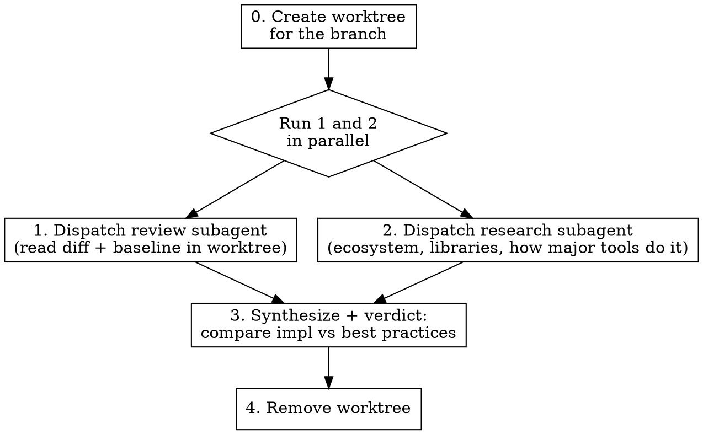

# Review With Research

## Overview

Reviews a branch by dispatching a code-review subagent in a worktree alongside a research subagent, then synthesizes their findings into an evidence-based verdict.

**Core principle:** Review in isolation (worktree), research the domain, compare against what established tools do. Never rubber-stamp, never just echo the user's hunch.

## When to Use

- User questions whether an approach is sound
- Review involves a technique worth verifying (locking, caching, auth, crypto, concurrency)
- User explicitly asks to research best practices

**Skip for:** pure style reviews or quick thumbs-up on small changes.

## Workflow



### 0. Create a worktree

```bash
git worktree add --detach .worktrees/review-<branch> <branch>
```

> **Why `--detach`?** If `<branch>` is already checked out (e.g., it's the current branch), `git worktree add` will refuse. Using `--detach` creates the worktree in detached HEAD state, avoiding the "already checked out" error. The worktree still has the branch's content.

Check that `.worktrees/` is in `.gitignore`. If not, add it before creating the worktree. This keeps the main session on its current branch. Clean up after the review.

### 0.5. Identify research topic

Before dispatching subagents, skim the diff briefly to identify the technique or domain to research:

```bash
git diff main..<branch> --stat
git diff main..<branch> | head -200
```

This is a quick read, not the full review — just enough to know the research topic (e.g., "file locking with advisory locks", "JWT refresh token rotation", "concurrent HashMap sharding"). If the diff is empty, short-circuit: report "nothing to review" and stop.

### 1. Dispatch review subagent (parallel with step 2)

Dispatch an `Explore` subagent (read-only) into the worktree.

| Parameter | Value |
|-----------|-------|
| `subagent_type` | `Explore` |
| `run_in_background` | `true` |

The subagent should:
- `cd <worktree-absolute-path>` as its first action (the Agent tool starts subagents in the parent's working directory, not the worktree)
- Read the full diff (`git diff main..<branch>`)
- Use `git show main:<path>` to read baseline files on main for context
- Read files directly from the worktree path for the branch version
- Summarize what the branch does and flag any concerns

**Subagent prompt template:**
> You are reviewing branch `<branch>`. First, `cd <worktree-absolute-path>`. Then read `git diff main..<branch>` and examine the changed files. Use `git show main:<path>` to read baseline files on main. Read files directly from the worktree for the branch version. Produce a detailed review: what the branch does, any correctness/design concerns with line numbers, and questions about the approach. Do NOT write code.

### 2. Dispatch research subagent (parallel with step 1)

| Parameter | Value |
|-----------|-------|
| `subagent_type` | `general-purpose` |
| `model` | `"sonnet"` |
| `run_in_background` | `true` |

Dispatch a `general-purpose` subagent to:
- Find established libraries/packages for the problem domain
- Check how major tools in the ecosystem solve it
- Identify known failure modes of the approach used

**Subagent prompt template:**
> Research best practices for [topic] in [language/ecosystem]. Find: (1) common libraries, (2) tradeoffs between approaches, (3) what well-known tools use, (4) known failure modes of [technique]. Do NOT write code.

### 3. Synthesize and deliver verdict

Compare the review subagent's findings against the research and produce a verdict with this structure:

- **What the branch does** — neutral summary
- **What the ecosystem does** — researched evidence
- **Specific problems** — line numbers and failure modes
- **Recommendation** — accept, reject, or revise with concrete alternative

**Reconciliation guidance:**
- If review and research **agree**, state the convergence and cite both.
- If review and research **contradict**, present both perspectives with specific evidence. Don't silently pick one — the user needs to see the tension.
- If research is **inconclusive** (topic too niche, conflicting sources), weight code review more heavily, evaluate on first principles, and note the gap explicitly.

**Handoff:** If the recommendation is "revise" and the user wants to proceed with fixes, hand off to `review-and-fix`.

### 4. Clean up

```bash
git worktree remove .worktrees/review-<branch>
```

## Key Rules

| Rule | Why |
|------|-----|
| Don't just confirm user suspicions | They want independent verification, not validation |
| Don't just contradict either | If the approach is fine, say so with evidence |
| Cite specifics, not vibes | "PID reuse is a known failure mode" beats "PIDs seem unreliable" |
| Always suggest the alternative | Rejection without a path forward isn't useful |
| Review in a worktree, not main | Don't switch branches on the main session |

## Common Mistakes

| Mistake | Fix |
|---------|-----|
| Reviewing on the main thread's branch | Always create a worktree — keep main session clean |
| Reviewing from memory, skipping research | Always dispatch research subagent — training data may be stale |
| Only reading the diff, not main | Need baseline context to judge what changed |
| Agreeing with user before researching | Research first, form opinion second |
